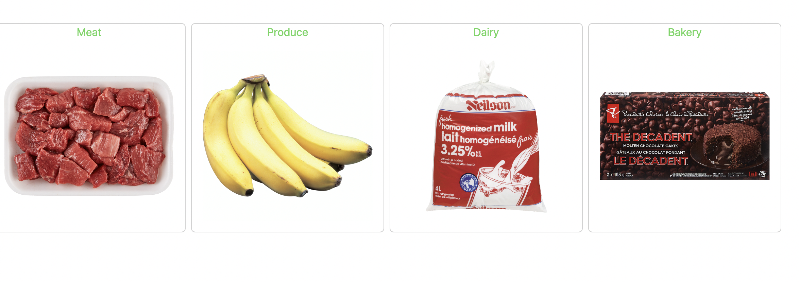
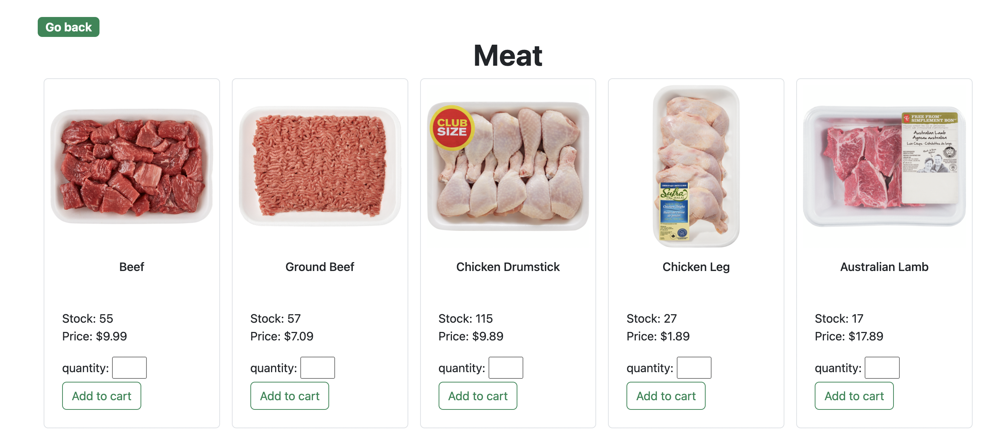
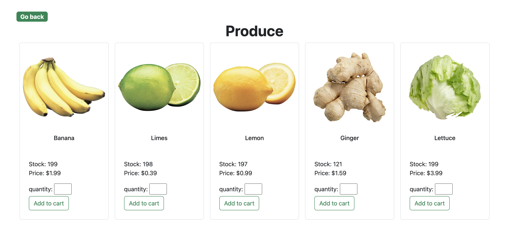
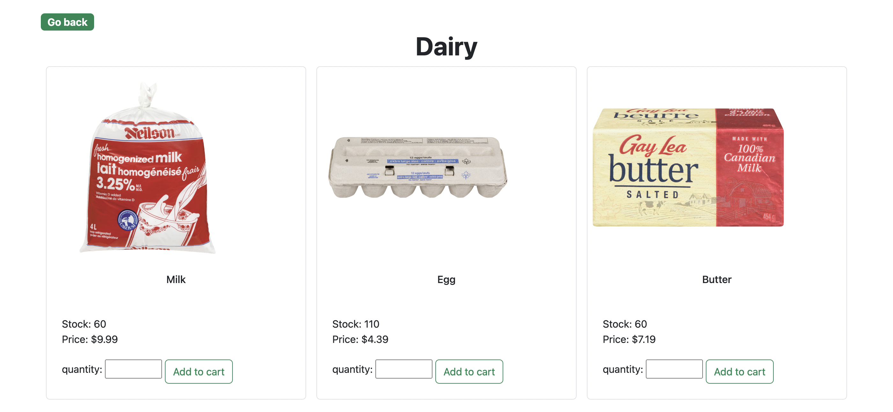
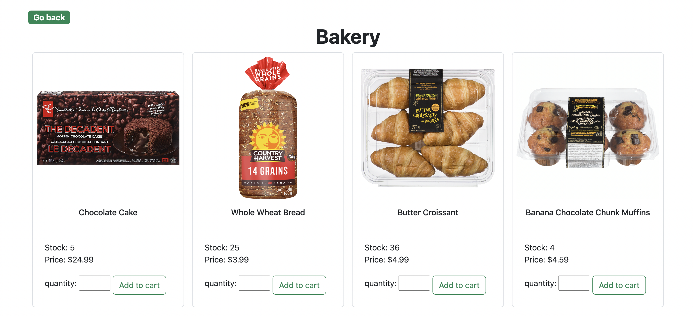

# Food-City-Grocery

## Table of Contents
  - [Description](#description)
  - [Usage](#usage)
  - [Screenshot](#screenshot)
  - [User-Story](#User-Story)
  - [License](#license)
  - [Contact](#contact)

# User-Story:

As a grocery store manager
I WANT a grocery store website
SO THAT I can allow users to buy their groceries online, then have the option to pick up or have it delivered.

- Users to browse products organized by Categories
- Users can add different products to their cart
- Users can create an account and log in to make their purchase
- Customer, product, and order data must be held in a database
- Admin must be able to edit customer, product, and order data in the back store
- Users can browse aisles, view descriptions of products, and add products to their cart.

# Work involved:

- HTML, CSS for static design
- Learned and used HTML, CSS with Bootstrap, JavaScript, SQL and Node.

# Description:
The website, a landing page for Food City Grocery is divided into the following sections:

- Homepage with exiciting feature
- Categories to be able to see Prouducts 
- Login feature 

# Usage:
Grocery stores are a destination for consumers who need to purchase food and household products for both everyday use and special occasions. The wide selection of products and brands, as well as high inventory levels, allow consumers to shop the goods that their household may need for a significant period of time.

# Screenshot:
- Categories

- Meat

- Produce

- Diary

- Bakery

- Login/Sign-up

- Payment Process

## Credits:
- keyshawn bhagwandin
- Xin Ling
- Abdirahman Daqane

## License:

## Contact:
https://github.com/keysbhag/Food-City-Grocery

